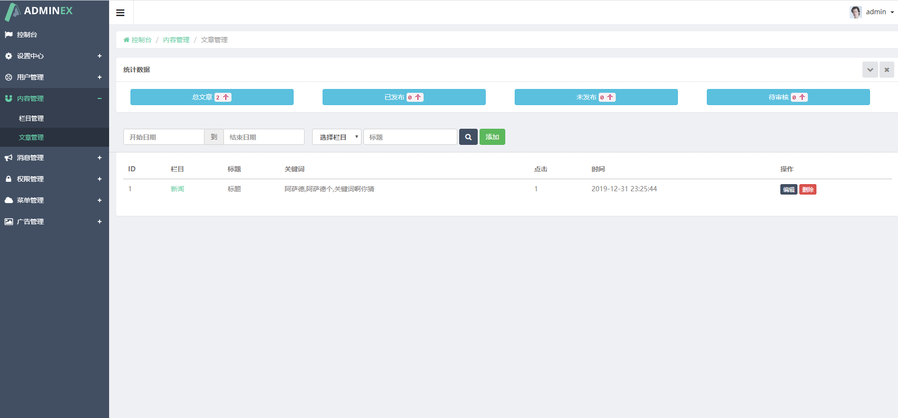

# Htadmin V0.1 后台cms框架

### 介绍
htadmin是基于Thinkphp5.0.24，算是tp5.0.x的最新版的后台管理系统，基本上融入常用的cms简单功能。

### 软件架构
htadmin是基于Thinkphp5.0.24，更新为最新的，但是好像最新版本也比较久了，最新6.x都出来了，喜欢这个版本的可以用。
htadmin是一个通用的后台管理系统，包含功能不多，有需要的下载使用哈，有bug也请反馈。

### 截图：

### 安装教程

1. 导入ht.sql 
2. 后台地址 ： /admin
3. 账户：admin / 123456

### 使用说明

1. 很多年前的东东了，那时候都是thinkphp5.0刚出来的时候，下你这发出来，有喜欢Adminex模板的小伙伴，可以自主使用。
2. Adminex的一个前端模板，大家懂的。。 
3. 欢迎star fork，有问题欢迎issue留言。